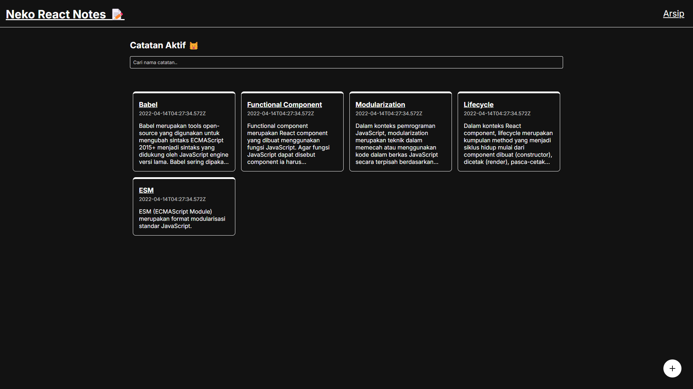
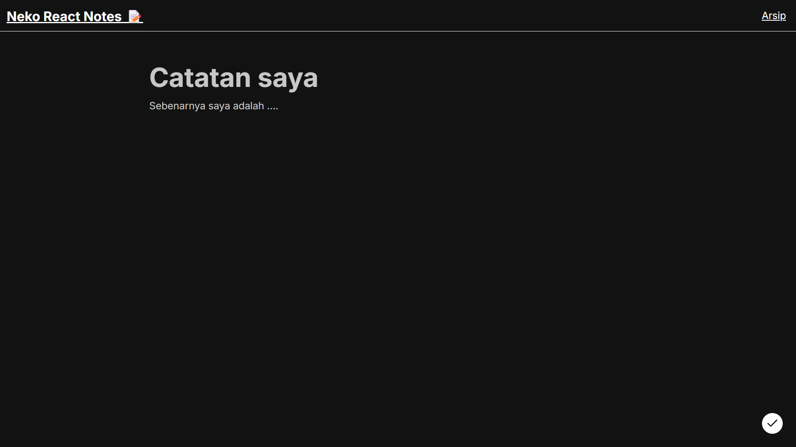
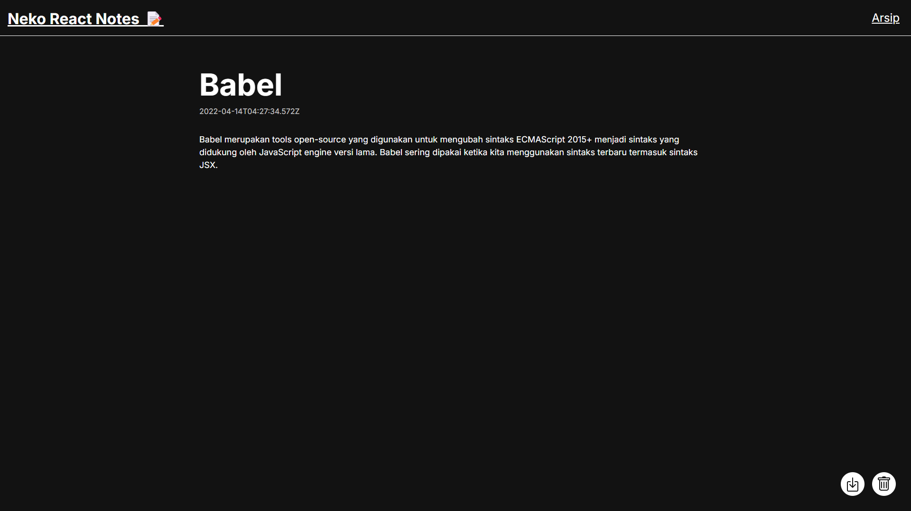
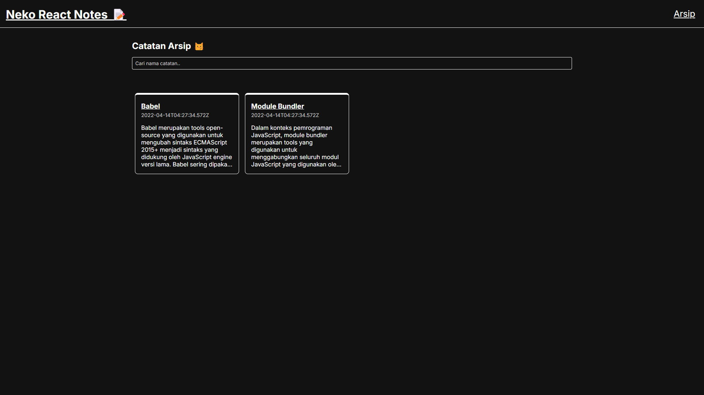
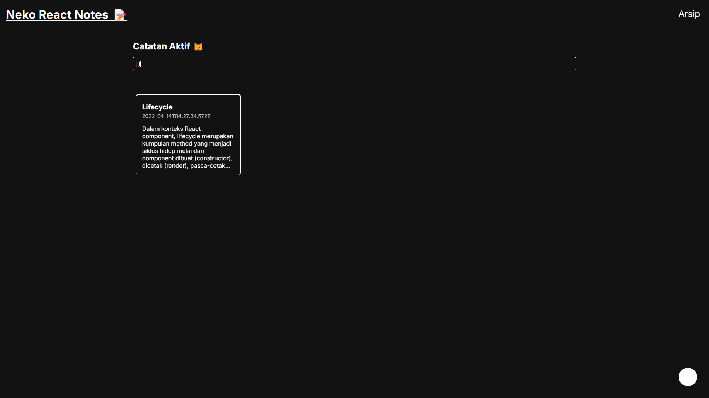

# Notes App React

A simple note taking app built with React. This app allows users to add, edit, and delete notes. It also has a search feature to search for notes by title or body.

## Features

- Add, edit and delete notes
- Search for notes by title or body
- Archive and unarchive notes

## Built With

- React
- React Router
- React Icons
- HTML-React-Parser

## Getting Started

1. Clone the repo
2. Install the dependencies with `npm install`
3. Start the app with `npm start`

## Screenshots

### Home Page

### Add Note Page

### Detail Note Page

### Archive Page

### Search Result

